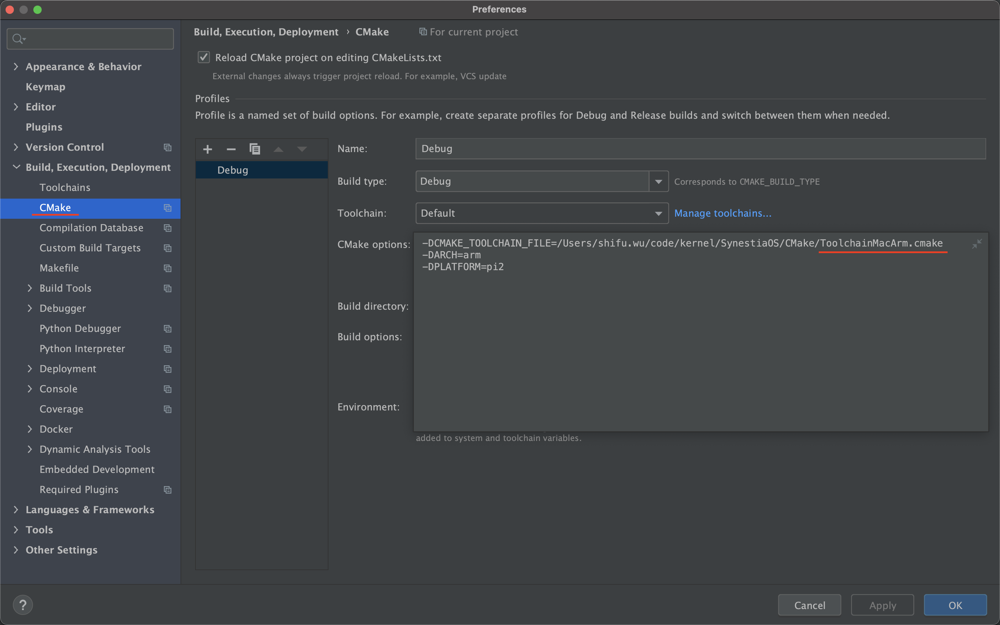
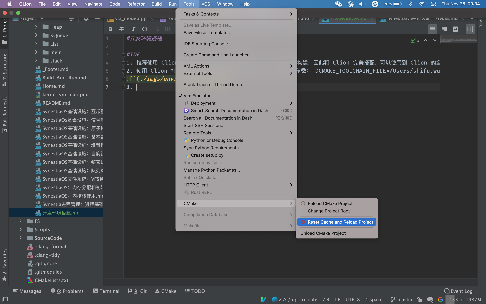
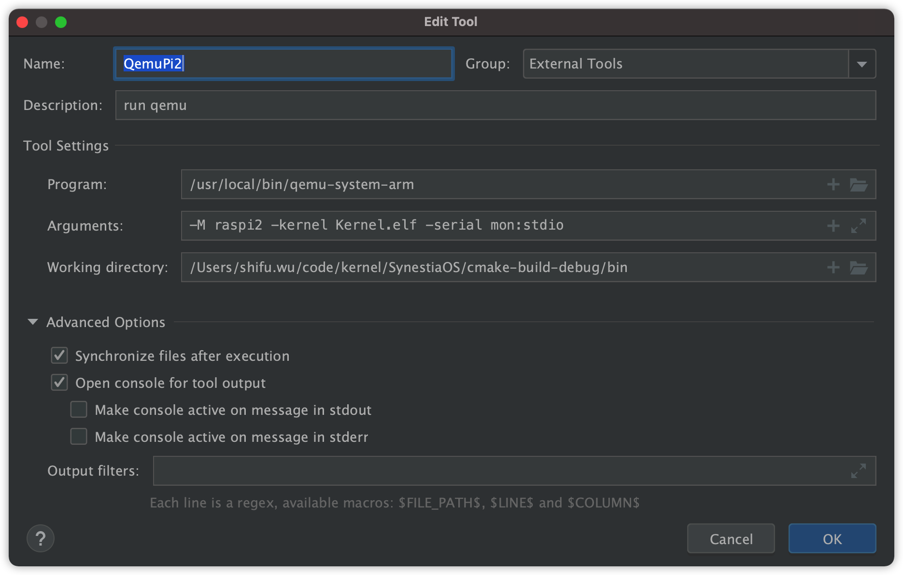
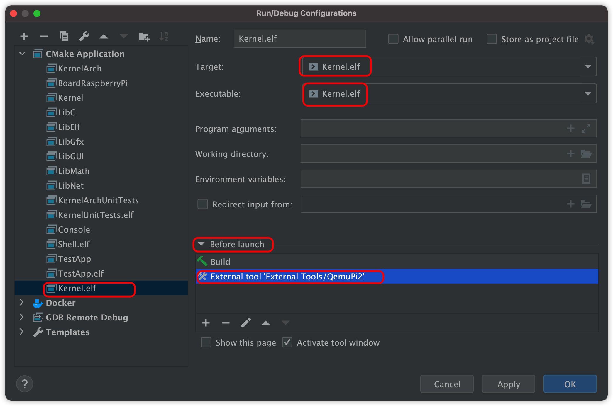
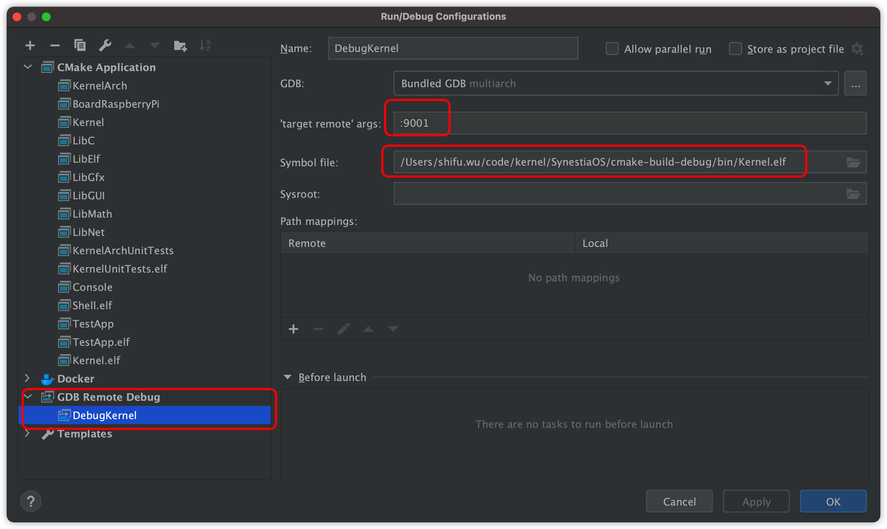
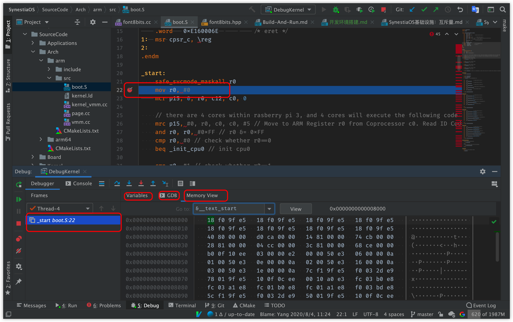

#开发环境搭建

#IDE
1. 推荐使用 Clion 来作为开发工具，因该项目使用 cmake 来进行构建，因此和 Clion 完美搭配，可以使用到 Clion 的全部功能，如代码提示，clang-tidy 代码分析，警告，快速的构建等
2. 使用 Clion 打开该工程，如下配置 Clion 中的 cmake，配置参数：-DCMAKE_TOOLCHAIN_FILE=/Users/shifu.wu/code/kernel/SynestiaOS/CMake/ToolchainMacArm.cmake -DARCH=arm -DPLATFORM=pi2，修改路径为本地机器的实际路径

3. reset cmake，如下

4. 由于我本机为 x86 架构，无法直接运行 arm 架构的文件，因此使用 Clion 中的 external tool 来运行 qemu 来运行该内核文件，配置 external tool 如下

5. 点击运行按钮，即可直接在 Clion 中运行该内核了

6. 在 Clion 中调试，同样可以使用 external tool 来先运行 qemu，并打开 qemu 的调试功能，使用命令：qemu-system-arm -M raspi2 -kernel Kernel.elf -gdb tcp::9001 -S -nographic，可以修改端口号为其他端口，启动 qemu 调试后，在 Clion 中配置如下

7. 点击 debug 按钮，然后即可开始在 Clion 中调试

